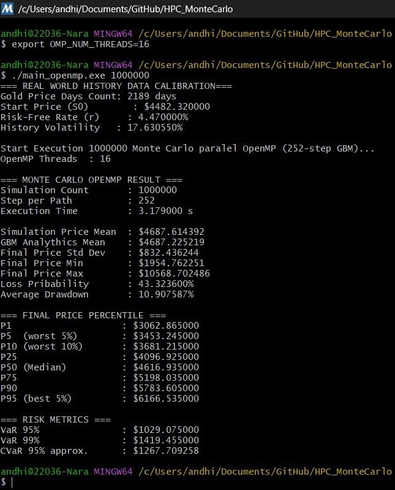
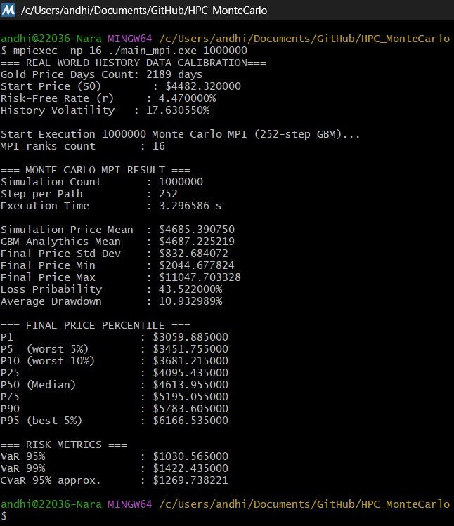

# Parallel Acceleration of Monte Carlo–Based Gold Investment Risk Analysis

**C++17 · OpenMP · MPI · Monte Carlo Simulation · Financial Risk Analytics · High-Performance Computing**

A reproducible high-performance computing study that accelerates Monte Carlo simulation for gold-investment risk analysis using two parallel programming models:

- **OpenMP** for shared-memory multithreading
- **MPI** for distributed-memory multiprocessing

The project calibrates a Geometric Brownian Motion (GBM) model from local historical gold-price and U.S. risk-free-rate datasets, then executes large-scale simulations to estimate terminal-price distributions and tail-risk metrics. The implementation is designed to show both the **parallelization strategy** and its **measured performance impact**.

> **Portfolio focus:** numerical modelling, parallel systems, reproducible experimentation, and quantitative risk analysis.

---

## Highlights

- Simulates **1,000,000 independent GBM paths**, each with **252 trading-day steps** — approximately **252 million stochastic state updates** per benchmark run.
- Implements both **OpenMP** and **MPI** backends in modern C++.
- Calibrates volatility from daily historical log returns and uses the latest available dataset values for the initial gold price and risk-free rate.
- Computes descriptive distribution statistics, loss probability, average drawdown, percentiles, **VaR (95% and 99%)**, and approximate **CVaR (95%)**.
- Uses memory-efficient **10,000-bin histograms** for percentile and expected-shortfall estimation instead of storing all simulated terminal prices.
- Includes captured benchmark outputs and an accompanying technical report under `result/`.

---

## Research Objective

Monte Carlo risk simulation is naturally parallel because individual paths are independent, but a large number of paths and time steps can still make sequential execution expensive. This repository investigates how shared-memory and distributed-memory parallelism reduce execution time while preserving statistically consistent risk estimates.

The study addresses three practical questions:

1. How can a path-independent Monte Carlo simulation be decomposed safely across threads or processes?
2. How do **OpenMP** and **MPI** scale under the same workload?
3. Can the accelerated implementation retain convergence toward the analytical GBM expectation while extracting tail-risk statistics efficiently?

---

## Model and Risk Metrics

### Geometric Brownian Motion

The simulated gold price follows:

```math
S_{t+\Delta t} = S_t \exp\left[\left(r - \frac{1}{2}\sigma^2\right)\Delta t + \sigma\sqrt{\Delta t}Z\right]
```

where:

- `S₀` is the latest historical gold price,
- `r` is the latest annual risk-free rate,
- `σ` is annualized historical volatility from daily log returns,
- `Δt = 1 / 252`, and
- `Z ~ N(0, 1)`.

For one-year validation, the simulation mean is compared with the GBM analytical expectation:

```math
\mathbb{E}[S_T] = S_0e^{rT}
```

### Reported outputs

| Category | Metrics |
|---|---|
| Distribution | mean, standard deviation, minimum, maximum |
| Downside exposure | loss probability, average drawdown |
| Percentiles | P1, P5, P10, P25, P50, P75, P90, P95 |
| Tail risk | VaR 95%, VaR 99%, approximate CVaR 95% |

---

## Parallelization Design

### OpenMP: shared-memory parallelism

The OpenMP implementation parallelizes the outer Monte Carlo path loop. Each thread owns its random-number generator and local histogram, while scalar statistics are combined with OpenMP reductions. Per-thread histograms avoid race conditions during bin updates and are merged after the parallel region.

```text
Historical CSV data
        │
        ▼
GBM calibration (S₀, r, σ)
        │
        ▼
OpenMP parallel-for over Monte Carlo paths
        │
        ├── Thread-local RNG
        ├── Thread-local histogram
        └── Reduction of scalar statistics
        │
        ▼
Merged distribution and risk metrics
```

### MPI: distributed-memory parallelism

MPI rank 0 reads and calibrates the input data, broadcasts the model parameters, and assigns a balanced contiguous block of simulation paths to each rank. Each rank builds local statistics and a local histogram. Global statistics are formed with `MPI_Reduce`; the reported execution time is the maximum elapsed time across ranks.

```text
Rank 0: read CSV + calibrate GBM
        │
        ▼  MPI_Bcast(S₀, r, σ, N)
All ranks simulate disjoint path blocks
        │
        ├── Local RNG and path simulation
        ├── Local histogram
        └── Local statistics
        │
        ▼  MPI_Reduce
Rank 0: global percentiles, VaR, CVaR, and timing
```

---

## Benchmark Snapshot

All benchmark captures in this repository use **1,000,000 paths × 252 steps**. Runtime is hardware- and environment-dependent; these measurements are evidence from the recorded benchmark runs, not universal performance claims.

### OpenMP results

| Threads | Execution time (s) | Speedup vs. 1 thread |
|---:|---:|---:|
| 1 | 28.216 | 1.00× |
| 2 | 13.453 | 2.10× |
| 4 | 6.782 | 4.16× |
| 8 | 4.876 | 5.79× |
| 12 | 3.682 | 7.66× |
| 16 | 3.180 | **8.87×** |

### MPI results

| MPI ranks | Execution time (s) | Speedup vs. 1 rank |
|---:|---:|---:|
| 1 | 28.360 | 1.00× |
| 4 | 7.395 | 3.83× |
| 8 | 5.442 | 5.21× |
| 12 | 3.522 | 8.05× |
| 16 | 3.297 | **8.60×** |

The results show strong early scaling for both approaches. Performance gains taper at higher worker counts because of shared hardware resources, synchronization overhead, process-management overhead, and the finite number of physical CPU cores.

| Representative evidence |
|---|
|  |
|  |

---

## Repository Structure

```text
MonteCarlo_HPC_Parallelization/
├── src/
│   ├── main_OpenMP.cpp              # Shared-memory implementation
│   ├── main_MPI.cpp                 # Distributed-memory implementation
│   ├── GoldPrice-USD.csv            # Historical gold-price data
│   └── RiskFreeRateUSA.csv          # Historical U.S. risk-free-rate data
├── result/
│   ├── result_OpenMP/               # Captured OpenMP benchmark outputs
│   ├── result_MPI/                  # Captured MPI benchmark outputs
│   └── MonteCarlo_Parallelization_Report.pdf
├── README.md
└── requirements.txt
```

---

## Requirements

This is a **native C++ project**; it has no Python package dependencies. See [`requirements.txt`](requirements.txt) for the system-level environment manifest.

Minimum environment:

- C++17-compatible compiler: GCC, Clang, or MSVC
- OpenMP runtime and compiler support
- MPI implementation for the MPI executable: Open MPI or MPICH
- A terminal environment with `g++` and `mpicxx`/`mpic++` available on `PATH`

### Linux (Ubuntu/Debian example)

```bash
sudo apt update
sudo apt install build-essential openmpi-bin libopenmpi-dev
```

### macOS (Homebrew example)

```bash
brew install gcc open-mpi
```

### Windows

Use one consistent native toolchain environment, such as **MSYS2 UCRT64 + Open MPI**, rather than Git Bash alone. Ensure that `g++`, `mpicxx`, and `mpirun` or `mpiexec` are visible from the same shell before compiling.

---

## Build

Run the following from the repository root.

### OpenMP

```bash
mkdir -p bin
g++ -O3 -std=c++17 -fopenmp src/main_OpenMP.cpp -o bin/montecarlo_openmp
```

### MPI

```bash
mkdir -p bin
mpicxx -O3 -std=c++17 src/main_MPI.cpp -o bin/montecarlo_mpi
```

For Windows command prompts, append `.exe` to output names where appropriate.

---

## Run

### OpenMP

Set the desired number of threads, then execute the model.

**Bash / Linux / macOS**

```bash
export OMP_NUM_THREADS=8
./bin/montecarlo_openmp 1000000 src/GoldPrice-USD.csv src/RiskFreeRateUSA.csv
```

**PowerShell**

```powershell
$env:OMP_NUM_THREADS = 8
.\bin\montecarlo_openmp.exe 1000000 src\GoldPrice-USD.csv src\RiskFreeRateUSA.csv
```

### MPI

```bash
mpirun -np 8 ./bin/montecarlo_mpi 1000000 src/GoldPrice-USD.csv src/RiskFreeRateUSA.csv
```

Some Open MPI installations require:

```bash
mpirun --oversubscribe -np 8 ./bin/montecarlo_mpi 1000000 src/GoldPrice-USD.csv src/RiskFreeRateUSA.csv
```

On Windows environments using Microsoft MPI, the equivalent launcher is commonly:

```powershell
mpiexec -n 8 .\bin\montecarlo_mpi.exe 1000000 src\GoldPrice-USD.csv src\RiskFreeRateUSA.csv
```

### Command-line arguments

```text
<executable> [simulation_count] [gold_price_csv] [risk_free_rate_csv]
```

Example:

```bash
./bin/montecarlo_openmp 500000 src/GoldPrice-USD.csv src/RiskFreeRateUSA.csv
```

---

## Reproducibility Notes

- The MPI implementation derives deterministic, rank-specific random seeds from a fixed base seed, allowing repeatable MPI benchmark behavior for a fixed environment.
- The OpenMP implementation creates independent thread-level random streams using time and thread identifiers. Its numerical outputs therefore vary slightly from run to run, as expected for Monte Carlo simulation.
- The included benchmark screenshots document a particular machine and toolchain. Before using the numbers in a report or publication, record the CPU model, core count, memory, OS, compiler version, compiler flags, MPI distribution, and number of repeated runs.
- The 10,000-bin histogram trades a small quantile approximation error for bounded memory use. This is deliberate: storing every terminal price would scale memory linearly with the number of paths.

---

## Limitations and Future Work

This project is intentionally focused on CPU-based parallel Monte Carlo acceleration. High-value extensions include:

- add a `CMakeLists.txt` and CI workflow for one-command cross-platform builds;
- publish data provenance, retrieval dates, and dataset licensing metadata;
- run repeated trials with median runtime, standard deviation, efficiency, and confidence intervals;
- compare static, dynamic, and guided scheduling in OpenMP;
- add hybrid MPI + OpenMP and GPU/CUDA variants;
- replace histogram quantiles with distributed selection or streaming quantile algorithms for tighter tail-risk accuracy;
- add unit tests for CSV parsing, GBM calibration, reductions, and risk-metric calculations.

---

## Authors

- [Andhika Narawangsa Susilo](https://github.com/andhikanarawangsa)
- Jovan Hosea H. Napitupulu
- Kayla Pramudio Bagas Aryasatya

---

## Citation

If this repository contributes to academic work, cite it as:

```bibtex
@software{montecarlo_hpc_parallelization,
  author  = {Susilo, Andhika Narawangsa and Napitupulu, Jovan Hosea H. and Aryasatya, Kayla Pramudio Bagas},
  title   = {Parallel Acceleration of Monte Carlo-Based Gold Investment Risk Analysis Using OpenMP and MPI},
  year    = {2026},
  url     = {https://github.com/andhikanarawangsa/MonteCarlo_HPC_Parallelization}
}
```

---

## Disclaimer

This repository is an academic and technical demonstration of high-performance Monte Carlo methods. It is **not financial advice** and should not be used as the sole basis for investment decisions.
